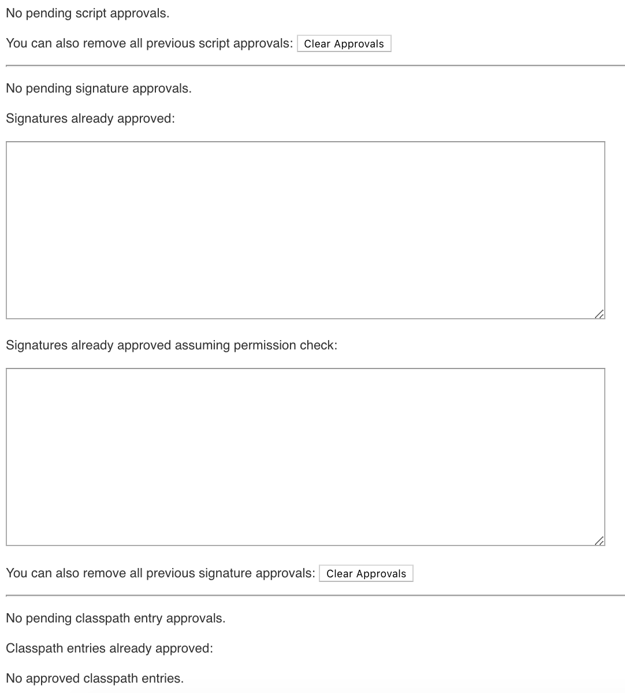

== Eliminate Script Approvals

In order to keep a stable running Controller, you should strive to keep the number of script approvals to zero, as reflected in the image below:

If there are script approvals, that is an indication that some jobs have been written incorrectly and may cause Controller instability.